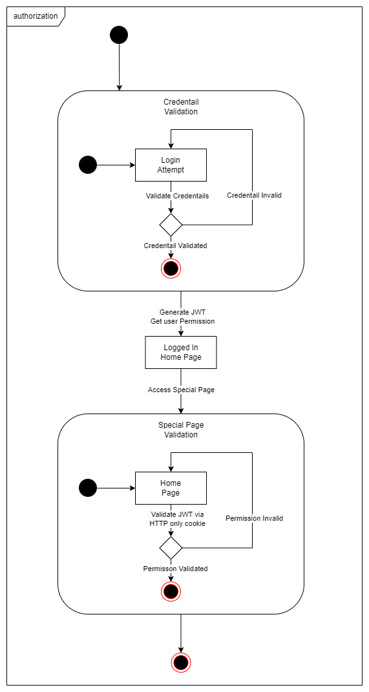

# Authorization Flow with JWT

This project implements a JWT-based authentication and authorization system. The flow is designed to manage user access to a home page and a special page with additional permissions.

## Table of Contents

- [Requirements](#requirements)
- [Pre-requisites](#pre-requisites)
- [Installation](#installation)
- [Usage](#usage)
- [Architecture](#architecture)

## Requirements

- Simulated generation of "secretphrase.txt" file
- Secure storage and retrieval of secret phrases
- Authentication process using the secret phrase
- Access control for special pages

## Pre-requisites

- Node.js (version 18.x or higher); The project uses v22.8.0
- pnpm (version 9.10.0)
- .env file at the root directory with the following content:

```.env
JWT_SECRET=secretPhrase
```

Otherwise, it uses `secretPhrase` as the default secret phrase.

## Installation

If you haven't had the pnpm installed, you can install it by running the following command:

```bash
npm install -g pnpm
```

Then,

```bash
pnpm install
```

# Usage

```bash
pnpm run start
```

# Architecture

## Technology Stack

- NuxtJS: A powerful Vue.js framework for building modern web applications
- NuxtUI: A UI library for Nuxt applications
- TypeScript: Adds static typing to enhance code quality and developer experience
- Pinia: State management for Vue applications

## Project Structure

The project follows the Nx monorepo structure for better scalability and maintainability. This approach offers:

1. Consistent development experience across the project
2. Automated dependency management
3. TypeScript support with auto-generated configuration files

## State Machine Overview



## Key States and Transitions

1. **Credential Validation**

   - **Login Attempt**: Users provide credentials to log in.
   - **Validate Credentials**: The system checks the provided credentials.
     - **Credential Invalid**: If credentials are incorrect, access is denied.
     - **Credential Validated**: If credentials are correct, proceed to generate a JWT.

2. **JWT Generation**

   - **Generate JWT**: A JWT is created for the authenticated user, including user permissions.
   - **Logged In**: The user is now authenticated and can access the home page.

3. **Home Page Access**

   - Users with a valid JWT can access the home page without additional checks.

4. **Special Page Validation**
   - **Access Special Page**: Users attempt to access a page requiring special permissions.
   - **Validate JWT via HTTP-only Cookie**: The system checks the JWT for necessary permissions.
     - **Permission Invalid**: If permissions are insufficient, access is denied.
     - **Permission Validated**: If permissions are valid, access to the special page is granted.
